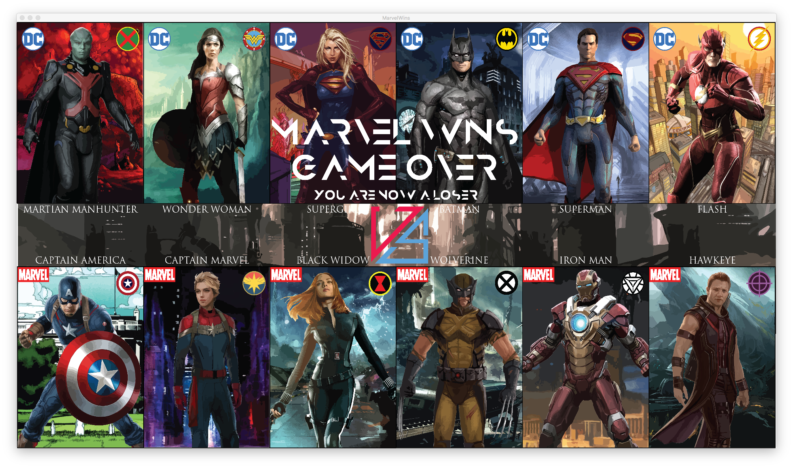
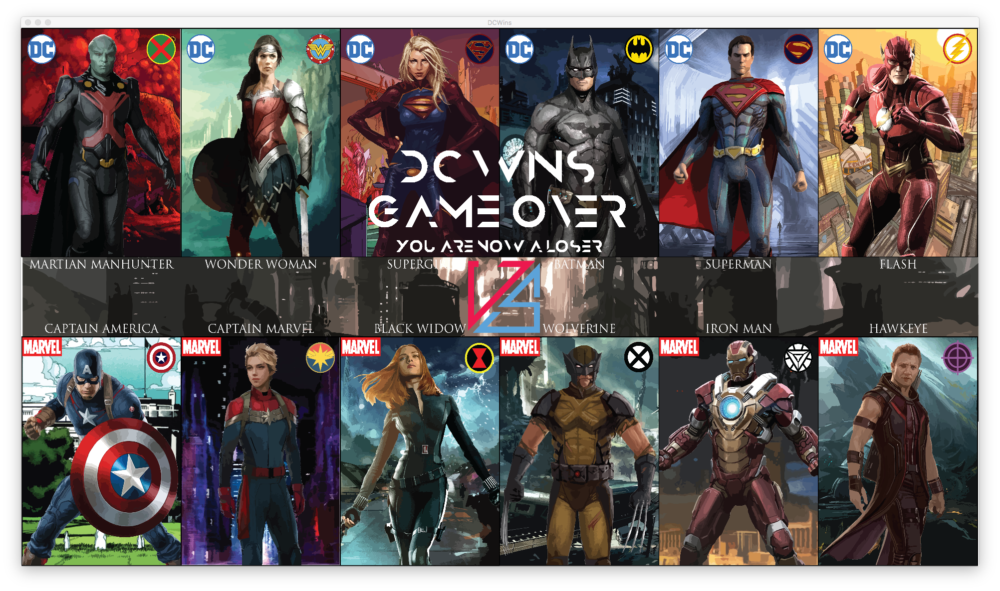
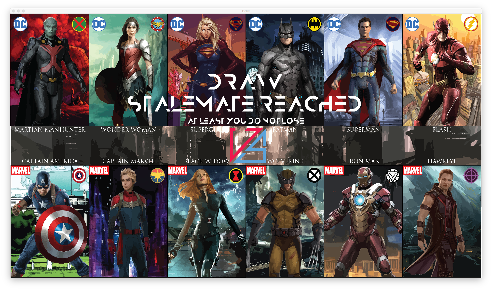

# Programming I Portfolio

## Chess: DC vs. Marvel

**Tessa Vu** \| 2017\
*With Bryn Esperson and Nastassja Motro*

------------------------------------------------------------------------

## Overview

We created a Chess game using Java and Processing. This program replicates a chess game interface similar to mobile or desktop chess applications, featuring a unique Marvel vs. DC theme with custom character pieces and special effects.

------------------------------------------------------------------------

## Basic Rules

Chess is a two-player game where one player controls the black pieces and the other controls the white pieces. Players cannot switch pieces mid-game. The goal is to checkmate the opponent's King.

### Check, Checkmate, and Stalemate

-   **Check** – When a King can be captured by an opponent's piece, the King is in check. Players must move to get out of check.

-   **Checkmate** – When a player is in check and cannot make any legal move to escape, they are checkmated and lose the game.

-   **Stalemate** – When a player has no legal moves but is not in check, the game ends in a draw.

------------------------------------------------------------------------

## Game Flow

### Starter Menu

The game opens with a themed main menu featuring Marvel vs. DC, where Marvel represents white pieces and DC represents black pieces.

**Code for Starter Menu:**

``` javascript
PImage startmenu;
PFont title;
PFont description;
int screenX, screenY, stage;

void setup() {
  size(1920, 1080);
  screenX = round(width);
  screenY = round(height);
  size(screenX, screenY);  
  startmenu = loadImage("Versus.png");
  image(startmenu, 0, 0, screenX, screenY);
  title = createFont("Anurati-Regular", 80, true);
  description = createFont("Anurati-Regular", 30, true);
}

void draw() {
  textAlight(CENTER);
  textFont(title);
  text("CHESS: DC v. MARVEL", width/2, 400);
  textFont(description);
  text("PRESS ANY KEY TO START THE GAME", width/2, 450);
  }
```

**Start Menu:**


------------------------------------------------------------------------

### Main Game

White (Marvel) always moves first. Movement is required every turn—players cannot skip their turn.

**Code for Main Chess Game Entry Point:**

``` javascript
public class Chess {
  public static void main(String[] args) {
s    private Board board = new Board();
    private Player marvel;
    private Player dc;
    public Chess() {
      super();
    }
    
    public void setColorMarvel(Player player) {
      this.marvel = player;
    }
    public void setColorDc(Player player) {
      this.dc = player;
    }
    public Board getBoard() {
      return board;
    }
    public void setBoard(Board board) {
      this.board = board;
    }
    public Player getMarvel() {
      return marvel;
    }
    public void setMarvel(Player marvel) {
      this.marvel = marvel;
    }
    public Player getDc() {
      return dc;    
    }
    public void SetDc(Player dc) {
      this.dc = dc;
    }
    
    public boolean initializeBoardGivenPlayer() {
      if(this.dc == null || this.marvel == null) {
        return false;
      }
      this.board = new Board();
      for(int i=0; i<dc.getPieces().size(); i++) {
        board.getSpot(dc.getPieces().get(i).getX(), dc.getPieces().get(i).getY()).occupySpot(dc.getPieces().get(i));
      }
      return true;
    }
  }
}
```

------------------------------------------------------------------------

### Playing Screen

The game board displays with themed character pieces.

**Mockup with character images:**


**Actual gameplay with character logos:**


------------------------------------------------------------------------

## Game Components

### Board

A standard 8×8 checkerboard with alternating light and dark squares.

**Code for Board:**

``` javascript
public class Board {
  private Spot[][] spots = new Spot[8][8];
  public Board() {
    super();
    for(int i=0; i<spots.length; i++) {
      for(int j=0; j<spots.length; j++) {
        this.spots[i][j] = new Spots(i, j);
      }
    }
  }
  public Spot getSpot(int x, int y) {
    return spots[x][y];
  }
}
```

------------------------------------------------------------------------

### Spot

Each square on the board can hold only one piece at a time. Captured pieces are immediately removed from the game.

**Code for Spot:**

``` javascript
apublic class Spot {
  int x, y;
  Piece piece;
  
  public Spot(int x, int y) {
    super();
    this.x = x;
    this.y = y;
    piece = null;
  }
  
  public void occupySpot(Piece piece) {
    //if there's already a piece there, delete it (taking away the piece)
    if(this.piece != null) {
      this.piece.setAvailable(false);
    }
    //place piece there
    this.piece = piece;
  }
  public boolean isOccupied() {
    if(piece != null) {
      return true;
    }
    return false;
  }
  
  public Piece releasedSpot() {
    Piece releasedPiece = this.piece;
    this.piece = null;
    return releasedPiece;
  }
}
```

------------------------------------------------------------------------

### Players

Two players alternate turns, moving one piece at a time (except during castling).

**Code for Player:**

``` javascript
public class Player {
  public final int PAWNS = 8;
  public final int BISHOPS = 2;
  public final int ROOKS = 2;
  public final int KNIGHTS = 2;
  public boolean marvel;
  
  private List<Piece> pieces = new ArrayList<>();
  
  public Player(boolean marvel) {
    super();
    this.marvel = marvel;
  }
  
  public List<Piece> getPieces() {
    return pieces;
  }
  
  public void initializePieces() {
    if(this.marvel == true) {
      for(int i=0; i<PAWNS; i++) { // draw pawns
        pieces.add(new Pawn(true, i, 2));
      } 
      pieces.add(new Rook(true, 0, 0));
      pieces.add(new Rook(true, 7, 0));
      pieces.add(new Bishop(true, 2, 0));
      pieces.add(new Bishop(true, 5, 0));
      pieces.add(new Knight(true, 1, 0));
      pieces.add(new Knight(true, 6, 0));
      pieces.add(new Queen(true, 3, 0));
      pieces.add(new King(true, 4, 0));
    } else {
      for(int i=0; i<PAWNS; i++) { // draw pawns
        pieces.add(new Pawn(true, i, 6));
      }
      pieces.add(new Rook(true, 0, 7));
      pieces.add(new Rook(true, 7, 7));
      pieces.add(new Bishop(true, 2, 7));
      pieces.add(new Bishop(true, 5, 7));
      pieces.add(new Knight(true, 1, 7));
      pieces.add(new Knight(true, 6, 7));
      pieces.add(new Queen(true, 3, 7));
      pieces.add(new King(true, 4, 7));
    }
  }
}
```

------------------------------------------------------------------------

## Pieces

Each player has 16 pieces: 1 King, 1 Queen, 2 Bishops, 2 Knights, 2 Rooks, and 8 Pawns. All piece classes inherit from the base `Piece` class.

### Character Assignments

**DC Team:** - **Martian Manhunter** – King - **Wonder Woman** – Queen - **Supergirl** – Bishop - **Batman** – Knight - **Superman** – Rook - **Flash** – Pawn

**Marvel Team:** - **Captain America** – King - **Captain Marvel** – Queen - **Black Widow** – Bishop - **Wolverine** – Knight - **Iron Man** – Rook - **Hawkeye** – Pawn

------------------------------------------------------------------------

### Base Piece Class

**Code for Main Piece Class:**

``` javascript
public abstract class Piece {
  private boolean available;
  private int x;
  private int y;
  
  public Piece(boolean available, int x, int y) {
    super();
    this.available = available;
    this.x = x;
    this.y = y;
  }
  
  public abstract boolean isAvailable() {
    return available;
  }
  public void setAvailable(boolean available) {
    this.available = available;
  }
  public abstract int getX() {
    return x;
  }
  public void setX(int x) {
    this.x = x;
  }
  public abstract int getY() {
    return y;
  }
  pubic void setY(int y) {
    this.y = y;
  }
  
  public abstract boolean isValid(Board board, int fromX, int fromY, int toX, int toY) {
    if(toX == fromX && toY == fromY) {
      return false; //move nothing
    }
    if(toX < 0 || toX > 7 || fromX < 0 || fromX > 7 || toY < 0 || toY > 7 || fromY < 0 || fromY > 7) {
      return false;
    }
    return true;
  }
}
```

------------------------------------------------------------------------

## Movement Rules

### King

Moves one square in any direction (horizontal, vertical, or diagonal). Can perform castling with a Rook under specific conditions. Must never move into check.

**Code for King Piece with Castling Move:**

``` javascript
public class King extends Piece {
  public booelan moved;
  public boolean castle;
  public King(boolean available, int x, int y) {
    super(available, x, y);
    this.moved = false;
    this.castle = false;
  }
  
  @Override
  public boolean isValid(Board board, int fromX, int fromY, int toX, int toY) {
    if(super.isValid(board, fromX, fromY, toX, toY) == false) {
      return false;
    }
    if(Math.abs(toX - fromX) > 1 || Math.abs(toY - fromY) > 1) {      
      if (moved) {
        return false;
      }
      return false;
    }
  }
}

if(fromY - toY == 2 && fromX == toX) {
  if(board[fromX][fromY + 1] != null || board[toX][toY + 2] != null) {
    castle = false;
    return false;
  }
} else if (fromY - toY == 3 && fromX == toX) {
  if(board[toX][fromY - 1] != null || board[toX][fromY - 2] != null || board[toX][fromY - 3] != null) {
    castle = false;
    return false;
  }
} else {
  castle = false;
  return false;
}
castle = true;
//moved = true;
return true;
```

------------------------------------------------------------------------

### Queen

Combines Rook and Bishop movement—can move horizontally, vertically, or diagonally any number of squares.

**Code for Queen Piece:**

``` javascript
public class Queen extends Piece {
  public Queen(boolean available, int x, int y) {
    super(available, x, y);
  }
  
  @Override
  public boolean isValid(Board board, int fromX, int fromY, int toX, int toY) {
    if(super.isValid(board, fromX, fromY, toX, toY) == false) {
      return false;
    }
    // diagonal stuff
    if(toX - fromX == toY - fromY) {
      return true;
    }
    if(toX == fromX) {
      return true;
    }
    if(toY == fromY) {
      return true;
    }
    return false;
  }
}
```

------------------------------------------------------------------------

### Bishop

Moves diagonally any number of squares. Stays on the same color square it starts on. Cannot jump over pieces.

**Code for Bishop Piece:**

``` javascript
public class Bishop extends Piece {
  public Bishop(boolean available, int x, int y) {
    super(available, x, y);
  }
  
  @Override
  public boolean isValid(Board board, int fromX, int fromY, int toX, int toY) {
    if(super.isValid(board, fromX, fromY, toX, toY) == false) {
      return false;
    }
    if(toX - fromX == toY - fromY) {
      return true;
    }
    return false;
  }
}
```

------------------------------------------------------------------------

### Knight

Moves in an L-shape: one step horizontal or vertical, then one step diagonally outward. Can jump over other pieces.

**Code for Knight Piece:**

``` javascript
public class Knight extends Piece {
  public Knight(boolean available, int x, int y) {
    super(available, x, y);
  }
  
  @Override
  public boolean isValid(Board board, int fromX, int fromY, int toX, int toY) {
    if(super.isValid(board, fromX, fromY, toX, toY) == false) {
      return false;
    }
    if(toX != fromX - 1 && toX != fromX + 1 && toX != fromX + 2 && toX != fromX - 2) {
      return false;
    }
    if(toY != fromY - 2 && toY != fromY + 2 && toY != fromY - 1 && toY != fromY + 1) {
      return false;
    }
    return false;
  }
}
```

------------------------------------------------------------------------

### Rook

Moves in straight lines horizontally or vertically. Cannot move diagonally. Can participate in castling.

**Code for Rook Piece with Castling Move:**

``` javascript
public class Rook extends Piece {
  public boolean moved;
  public boolean castle;
  public Rook(boolean available, int x, int y) {
    super(available, x, y);
    this.moved = false;
    this.castle = false;
  }
  
  @Override
  public boolean isValid(Board board, int fromX, int fromY, int toX, int toY) {
    if(super.isValid(board, fromX, fromY, toX, toY) == false) {
      return false;
    }
    if(Math.sqrt(Math.pow(Math.abs((toX - fromX)),2)) + Math.pow(Math.abs((toY - fromY)), 2) != Math.sqrt(2)) {
      return false;
    }
    if(Math.abs(toX - fromX) > 1 || Math.abs(toY - fromY) > 1) {
      if(moved) {
        return false;
      }
      if(toX == fromX) {
        return true;
      }
      if(toY == fromY) {
        return true;      }
      return false;
    }
  }
}

if(fromY - toY == 2 & fromX == toX) {
  if(board[fromx][fromY + 1] != null || board[toX][toY + 2] != null) {
    castle = false;
    return false;
  }
} else if(from Y - toY == 3 && fromX == toX) {
  if(board[toX][fromY - 1] != null || board[toX][fromY - 2] != null || board[toX][fromY - 3] != null) {
    castle = false;
    return false;
  }
} else {
  castle = false;
  return false;
}
castle = true;// moved = true;
return true;
```

------------------------------------------------------------------------

### Pawn

Moves forward one square (or two on its first move). Captures diagonally forward one square. Can perform en passant capture.

**Code for Pawn Piece with En Passant Move:**

``` javascript
public class Pawn extends Piece {
  public boolean hasMoved;
  public boolean ep_able;
  public boolean switch;
  public Pawn(boolean available, int x, int y) {
    super(available, x, y);
  }
  
  @Override
  public boolean isValid(Board board, int fromX, int fromY, int toX, int toY) {
    if(fromX == toX) {
      if(board[fromY + 1][fromX] != null) {
        return false;
      }
    } else {
      if(board[fromY - 1][fromX] != null) {
        return false;
      }
    }
    if(Math.abs(toY - fromY) > 2) {
      return false;
    } else if(Math.abs(toY - fromY == 2)) {
      if(hasMoved) {
        return false;
      }
      if(toX + 1 < 8) {
        if(board[toY][toX + 1] != null) {
          if(board[toY][toX + 1].getClass().isInstance(new Pawn ("marvel"))) {
            ep_able = true;
          }
        }
      }
    }
  } else {
    if(Math.abs(toX - fromX) != 1 || Math.abs(toY - fromY) != 1) {
      return false;
    }
    if(board[toY][toX] == null) {
      return false;
    }
  }
  return true;
}
```

------------------------------------------------------------------------

## Special Moves

### Castling

A simultaneous King and Rook move under these conditions:

-   Neither the King nor Rook has moved previously
-   The King is not in check
-   The King does not move through or into check
-   All squares between King and Rook are empty
-   King and Rook are on the same rank

When castling: the King moves two squares toward the Rook, and the Rook moves over the King to the adjacent square.

------------------------------------------------------------------------

### En Passant

A special pawn capture move:

-   Occurs when an opponent's pawn moves two squares forward on its initial move, landing beside your pawn
-   You can capture it as if it had only moved one square
-   This option is only available for one move immediately after the opponent's pawn move

------------------------------------------------------------------------

## End Game

The game ends when a player achieves checkmate or the game reaches a draw (stalemate).

### Marvel Wins

**Code for Marvel Winning:**

``` javascript
PImage gameover;
PFont title;
PFont description;
int screenX, screenY, stage;

void setup() {
  size(1920, 1080);
  screenX = round(width);
  screenY = round(height);
  size(sreenX, screenY);
  gamover = loadImage("Versus.png");
  image(gameover, 0, 0, screenX, screenY);
  title = createFont("Anurati-Regular", 80, true);
  description = createFont("Anurati-Regular", 30, true);
}

void draw() {
  textAlign(CENTER);
  textFont(title);
  text("MARVEL WINS", width/2, 310);
  text("GAME OVER", width/2, 400);
  textFont(description);
  text("YOU ARE NOW A LOSER", width/2, 450);
}
```



------------------------------------------------------------------------

### DC Wins

**Code for DC Winning:**

``` javascript
PImage gameover;
PFont title;
PFont description;
int screenX, screenY, stage;

void setup() {
  size(1920, 1080);
  screenX = round(width);
  screenY = round(height);
  size(screenX, screenY);
  gameover = loadImage("Versus.png");
  image(gameover, 0, 0, screenX, screenY);
  title = createFont("Anurati-Regular", 80, true);
  description = createFont("Anurati-Regular", 30, true);
}

void draw() {
  textAlight(CENTER);
  textFont(title);
  text("DC WINS", width/2, 310);
  text("GAME OVER", width/2, 400);
  textFont(description);
  text("YOU ARE NOW A LOSER", width/2, 450);
}
```



------------------------------------------------------------------------

### Draw

**Code for Draw:**

``` javascript
PImage gameover;
PFont title;
PFont description;
int screenX, screenY, stage;

void setup() {
  size(1920, 1080);
  screenX = round(width);
  screenY = round(height);
  size(screenX, screenY);
  gameover = loadImage("Versus.png");
  image(gameover, 0, 0, screenX, screenY);
  title = createFont("Anurati-Regular", 80, true);
  description = createFont("Anurati-Regular", 30, true);
}

void draw() {
  textAlign(CENTER);
  textFont(title);
  text("DRAW", width/2, 310);
  text("STALEMATE REACHED", width/2, 400);
  textFont(description);
  text("AT LEAST YOU DID NOT LOSE", width/2, 450);
}
```



------------------------------------------------------------------------
